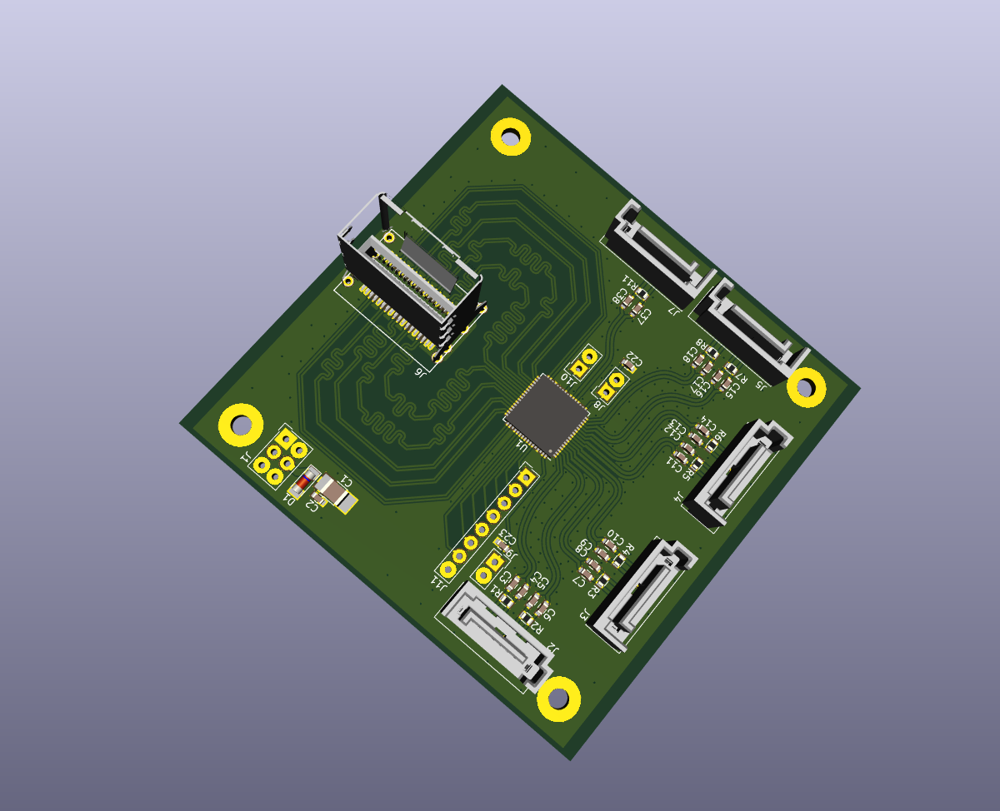

[Czech](./README.cs.md)
<!--- module --->
# ADCoctoSPI01A - Octal input high-speed ADC

<!--- Emodule --->

<!--- subtitle --->
<!--- Esubtitle --->

<!--- description --->

## Parameters

| Parameter | Value | Description |
|-----------|-------|-------------|
| ADC chip | [AFE5801](https://www.ti.com/product/AFE5801) | Other possible types are AFE5803, AFE5804 etc. |
| LVDS connector | miniSAS |  |
| Service interface | SPI interface |  |
| Operating and storage temperature | -20 - +40°C |  |
| Operational input voltage | 3.6 - 5.4V | |

<!--- Edescription --->
