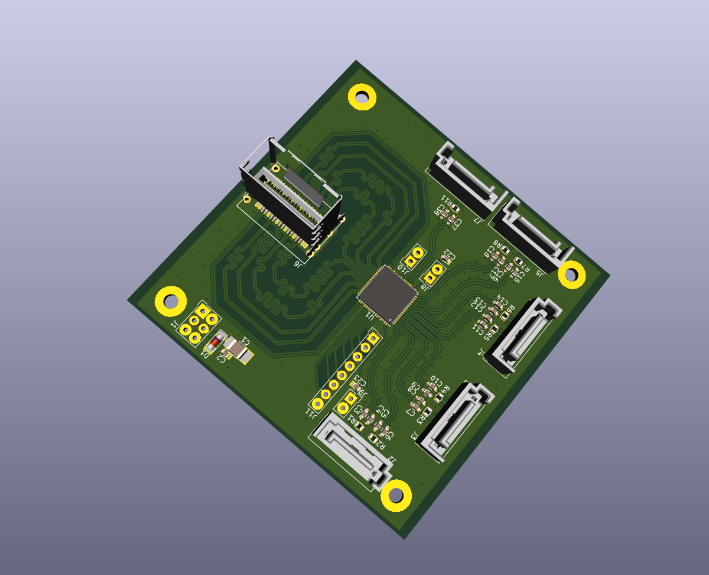

# ADCoctoSPI01 - Octal Input High-Speed ADC Module

The ADCoctoSPI01 is an eight-channel, high-speed analog-to-digital conversion module designed for signal acquisition in imaging and similar high-speed applications. It integrates a Texas Instruments AFE5801 analog front-end (AFE), which combines eight variable-gain amplifiers (VGAs) and eight 12-bit ADCs with a sampling rate up to 65 MSPS. Data output is serialized through an LVDS interface.

This module is ideally used in combination with the [MPPB01 baseboard for Parallella](https://www.mlab.cz/module/MPPB01/), which features a compatible miniSAS connector, allowing for direct integration and high-speed data transfer.

## Features

* **8 differential analog input channels**
* **Integrated AFE5801 from Texas Instruments**
  * 8x VGAs with -5 dB to 31 dB gain range
  * 8x 12-bit ADCs, up to 65 MSPS sampling rate
  * Integrated anti-aliasing filter (7.5 / 10 / 14 MHz selectable)
  * Serial LVDS output
  * SPI control interface
* **MiniSAS (SFF-8087) connector for LVDS data output**
* **Separate SPI interface for configuration and diagnostics**
* **On-board linear regulators for 1.8V and 3.3V supplies**
* **Operating voltage: 3.6 V to 5.4 V**
* **Operating temperature: -20 °C to +40 °C**

## Technical Specifications

| Parameter                       | Value             | Description                          |
| ------------------------------- | ----------------- | ------------------------------------ |
| ADC Resolution                  | 12 bits           | Per channel                          |
| Number of Channels              | 8                 | Differential                         |
| Max Sampling Rate               | 65 MSPS           | Per channel                          |
| Input Voltage Swing             | 2 Vpp             | Differential, max linear input range |
| VGA Gain Range                  | -5 dB to +31 dB   | Step size: 0.125/1 dB                |
| Input Referred Noise            | 5.5 nV/√Hz        | At VGA gain = 31 dB                  |
| Signal-to-Noise Ratio (SNR)     | ~65 dBFS          | Typical at 65 MSPS, -1 dBFS input    |
| Total Harmonic Distortion (THD) | -65 dBFS          | At 5 MHz input, max gain             |
| Antialias Filter Cutoff         | 7.5 / 10 / 14 MHz | Programmable                         |
| Common-Mode Input Voltage (VCM) | 1.6 V             | Recommended bias for AC coupling     |
| Input Capacitance               | 2 pF              | Differential input                   |
| Input Resistance                | 5 kΩ              | To internal bias                     |

## Connectors

* **J1-J4**: Differential analog inputs (IN1P/M to IN8P/M) (SATA connectors)
* **J10A**: MiniSAS connector for serialized LVDS data (D1-D8, FCLK, DCLK)
* **J8**: SPI control interface (SCLK, SDATA, SDOUT, SEN, RESET, SYNC)
* **J11**: Power input (+5V, GND)

## Power Supply

* Requires a single 5V power supply.
* Onboard regulators generate 3.3V and 1.8V for AFE operation.

## AFE5801 Configuration Highlights

* **Gain Control**: SPI-controlled VGA gain, from -5 dB to 31 dB in 0.125 dB or 1 dB steps
* **Clamping and Filtering**: Optional signal clamping and integrated third-order low-pass filter
* **Sampling Clock**: Differential clock input (LVDS/PECL supported)
* **LVDS Output**: Serialized outputs for each channel (D1-D8), frame clock (FCLK), and data clock (DCLK)

## Typical Applications

* Medical ultrasound systems
* Non-destructive testing
* High-speed data acquisition
* Multichannel signal digitization in SDR receivers

## References

* [AFE5801 Datasheet](https://www.ti.com/product/AFE5801)
* Other compatible AFEs: AFE5805, AFE5809 (with differing performance and power specs)

## Notes

* Only the AFE5801 is populated by default; board supports footprint-compatible variants (AFE5803, AFE5804 etc.).
* For optimal performance, ensure proper analog signal termination and impedance matching on all differential inputs.
* Follow ESD precautions during handling.

